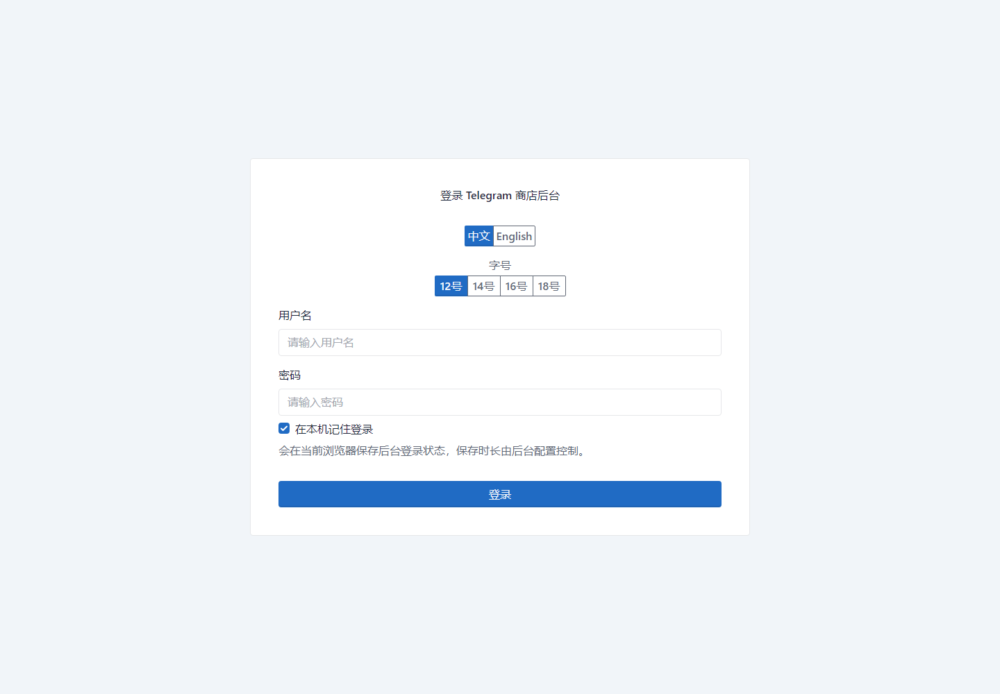
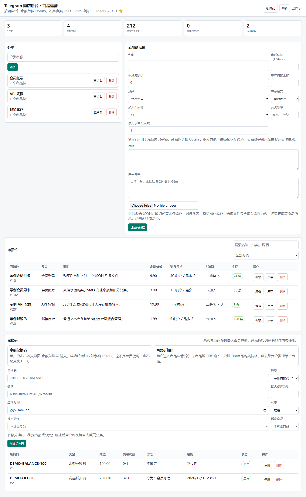
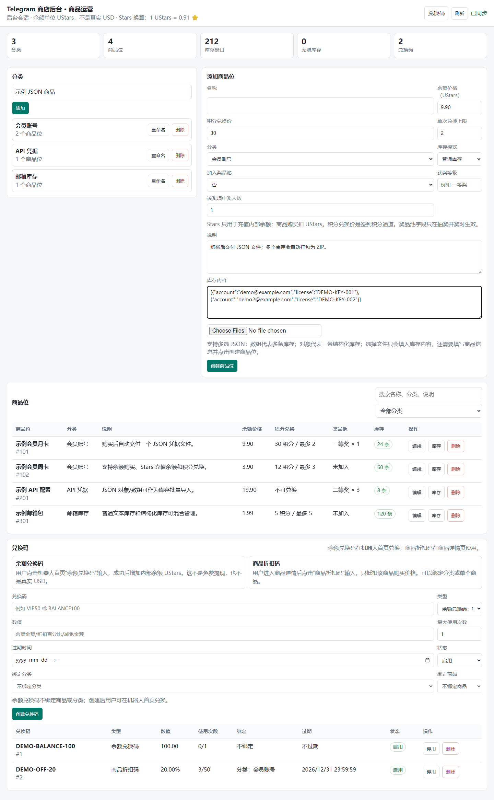

# TGSellBot Telegram 自动售卖机器人

一套面向 Telegram 的自动售卖机器人，支持数字商品库存、JSON 文件交付、购物车、优惠码、积分签到、邀请奖励、抽奖、后台管理、i18n、多支付方式和 Docker 部署。

语言: [English](README.md) | [简体中文](README.zh-CN.md)

[](https://www.python.org/downloads/)
[](https://docs.aiogram.dev/)
[](https://www.postgresql.org/)
[](https://www.docker.com/)
[](LICENSE)
[](https://github.com/leochena/tgsellbot/stargazers)
[](https://github.com/leochena/tgsellbot/graphs/contributors)
[](https://github.com/leochena/tgsellbot/issues)
[](.github/CONTRIBUTING.md)
[](https://t.me/+6dcMgO8XsN41NWNl)
[](https://t.me/+6dcMgO8XsN41NWNl)
[](https://linux.do)

## 社区与链接

- Telegram 交流频道: [https://t.me/+6dcMgO8XsN41NWNl](https://t.me/+6dcMgO8XsN41NWNl)
- 友情链接: [linux.do](https://linux.do)
- 欢迎提交 [Issues](https://github.com/leochena/tgsellbot/issues) 和 [Pull Requests](https://github.com/leochena/tgsellbot/pulls)
- 贡献说明: [.github/CONTRIBUTING.md](.github/CONTRIBUTING.md)

## 当前界面截图

以下截图由当前管理端生成，内容已替换为示例数据。







## 主要能力

- 商品分类和商品管理
- 数字库存管理，支持文本库存和 JSON 文件库存
- 用户购买单个 JSON 库存时交付 `.json` 文件，购买多个 JSON 库存时自动打包为 `.zip`
- 购物车、批量购买、优惠码和余额抵扣
- Telegram Stars、CryptoPay、Telegram Payments provider token 等支付方式
- 签到积分、连续签到奖励、积分兑换商品
- 群邀请奖励，支持按邀请人数阶梯提高奖励
- 商品加入奖品池、设置奖项等级、中奖人数和自动开奖条件
- 用户语言切换，支持俄文、英文、中文
- Web 管理后台，支持中英文界面和字号调整
- PostgreSQL 持久化，Redis 可选缓存
- 审计日志、健康检查、指标接口和数据导出

## 适用场景

这个项目主要面向数字商品自动交付，例如账号、授权码、配置文件、JSON 凭据、兑换码、接码服务库存、邮箱库存等。

如果要销售实体商品，需要额外处理地址、物流、售后和实物商品支付合规问题。当前项目已支持通过 Telegram Payments provider token 接入类似 Stripe 的银行卡支付能力，但具体可销售品类仍需要遵守 Telegram、支付服务商和所在地法律要求。

## 技术栈

- Python 3.11+
- aiogram 3.x
- PostgreSQL 16+
- SQLAlchemy 2.x / Alembic
- Redis 7+ 可选
- Starlette / SQLAdmin 管理后台
- Docker / Docker Compose

## 快速开始

### 1. 克隆项目

```bash
git clone https://github.com/leochena/tgsellbot.git
cd tgsellbot
```

### 2. 创建配置文件

```bash
cp .env.example .env
```

至少需要配置：

| 变量 | 示例说明 |
| --- | --- |
| `TOKEN` | BotFather 创建的机器人 token |
| `OWNER_ID` | 你的 Telegram ID |
| `POSTGRES_DB` | PostgreSQL 数据库名 |
| `POSTGRES_USER` | PostgreSQL 用户名 |
| `POSTGRES_PASSWORD` | PostgreSQL 强密码 |
| `POSTGRES_HOST` | Docker 部署通常为 `db` |
| `DB_PORT` | PostgreSQL 端口，通常为 `5432` |
| `ADMIN_USERNAME` | 管理后台用户名 |
| `ADMIN_PASSWORD` | 管理后台强密码 |
| `SECRET_KEY` | 随机长密钥 |
| `BOT_LOCALE` | 中文可设为 `zh` |

生产环境不要使用默认后台账号、默认密码或示例密钥。

### 3. Docker 部署

启用 Redis：

```bash
docker compose --profile redis up -d --build
```

不启用 Redis：

```bash
docker compose up -d --build
```

查看日志：

```bash
docker compose logs -f bot
```

### 4. 手动部署

```bash
python3.11 -m venv venv
source venv/bin/activate
pip install --upgrade pip
pip install -r requirements.txt
alembic upgrade head
python run.py
```

Windows PowerShell 激活虚拟环境：

```powershell
.\venv\Scripts\Activate.ps1
```

## 管理后台

默认地址：

```text
http://localhost:9090/admin
```

后台账号来自 `.env`：

```env
ADMIN_USERNAME=admin
ADMIN_PASSWORD=admin
```

生产环境必须修改默认值。远程部署时建议只让后台监听本机或通过 SSH 隧道访问，不要直接暴露到公网。

## 商品和库存

后台可以创建分类、商品和库存。数字库存可以是普通文本，也可以是结构化 JSON：

- 单个 JSON 对象会作为一条库存
- JSON 数组会作为多条库存
- 包含 `items`、`stock`、`values`、`data` 数组的 JSON 对象会按数组导入多条库存
- 多个 JSON 文件可以一次选择上传，系统会合并为一批库存

用户购买后：

- 单个 JSON 库存交付 `.json` 文件
- 多个 JSON 库存交付 `.zip` 压缩包
- 普通文本库存按文本消息或购买记录交付

## 积分、邀请和抽奖

- 每日签到默认奖励积分
- 连续签到时，当天奖励可以随连续天数增加
- 商品可以设置积分兑换价格和单次兑换最大数量
- 用户邀请新成员进入群组后，可以在被邀请用户完成签到后给邀请人发放积分
- 邀请奖励支持阶梯规则，邀请人数越多，单个有效邀请奖励越高
- 商品可以加入奖品池，并设置获奖等级、每个等级获奖人数和自动开奖时间或条件

## 支付说明

当前支持的支付方向：

- Telegram Stars：适合 Telegram 生态内数字商品
- CryptoPay：支持 TON、USDT、BTC、ETH 等加密货币
- Telegram Payments provider token：可接入 Telegram 支持的支付服务商，例如 Stripe/card 场景
- 内部余额单位可显示为 `UStars`，它不是真实 USD

请注意：支付服务商是否支持你的地区、商品类型和账户主体，需要以 Telegram 和支付服务商的实际审核规则为准。

## 常用环境变量

| 变量 | 说明 |
| --- | --- |
| `TOKEN` | BotFather 创建的 Telegram 机器人 token |
| `OWNER_ID` | 机器人拥有者 Telegram ID |
| `BOT_LOCALE` | 默认语言，支持 `ru`、`en`、`zh` |
| `TELEGRAM_PROVIDER_TOKEN` | Telegram Payments 支付服务商 token |
| `CRYPTO_PAY_TOKEN` | CryptoPay API token |
| `STARS_PER_VALUE` | Stars 充值到内部余额的兑换比例 |
| `BALANCE_CURRENCY` | 内部余额显示名称，例如 `UStars` |
| `ADMIN_HOST` | 管理后台监听地址 |
| `ADMIN_PORT` | 管理后台端口，默认 `9090` |
| `ADMIN_USERNAME` | 管理后台用户名 |
| `ADMIN_PASSWORD` | 管理后台密码 |
| `SECRET_KEY` | 后台 session 加密密钥 |

更多配置见 [.env.example](.env.example)。

## 测试

```bash
pytest -q
```

格式检查：

```bash
git diff --check
```

## 贡献

欢迎提交 Issue 和 Pull Request。

提交 PR 前请尽量做到：

- 问题描述清楚
- 改动范围聚焦
- 涉及行为变化时补充测试
- 涉及配置、部署或用户使用方式时更新文档
- 不提交 `.env`、token、私钥、数据库备份、生产日志或用户数据

更多说明见 [.github/CONTRIBUTING.md](.github/CONTRIBUTING.md)。

## 安全

不要在公开 Issue、PR、截图或日志中提交：

- Telegram bot token
- 支付服务商 token
- SSH 私钥
- 数据库账号密码
- 生产 `.env`
- 用户隐私数据

安全问题请按 [SECURITY.md](SECURITY.md) 说明处理。

## 许可证

主协议为 MIT License，详见 [LICENSE](LICENSE)。

附加项目条款：

- 本项目可免费商用、自用。
- 禁止二次闭源打包售卖。
- 禁止作为付费独立产品分发。

本项目部分代码来源于 [interlumpen/Telegram-shop](https://github.com/interlumpen/Telegram-shop)，原项目使用 MIT License。原始版权声明见 [NOTICE](NOTICE)。
